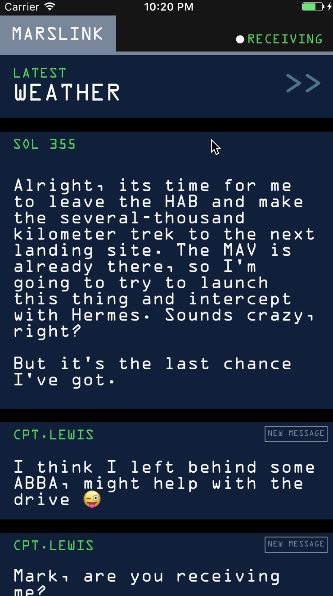

Marslink
==========

Abstract:
    Now-a-days, mobile applications implement complex
functionalities that use device’s core features
extensively. Mobile application development includes
asynchronous multi-threaded code execution, drawing
views/elements on the screen and basic network
communications.
Keywords:
    iOS; mobile application development; mobile
device core features; common scenario performance
comparison; development optimisation
Introduction:
    The rapid development of the mobile devices
industry has culminated with the rise of modern
operating systems, specifically optimised to use the
advantages and limits of the hardware environment in
order to interface with the user.
Apple’s approach to a mobile operating system was
quite different, as iOS was developed to run on a
very specific set of devices, which feature an
established list of hardware components. The close
relationship between the hardware setup and the
operating system development have tied the success of
iOS platform to the popularity of its host devices.
This approach, however, also represents an advantage,
as iOS was optimised to have a responsive and fast
interface, designed specifically around its hardware
limitations.

iOSApplicationDevelopment
==========
    The iOS application authoring tool XCode offers
two native options regarding the main development
language: Objective C and Swift. Currently, Swift is
being promoted for the development of new application
that run in the Apple ecosystem.
Visual structure of the whole application can be
managed in a single file using the Storyboard
environment. Each individual scene was constructed
using static View Controllers for standalone pages
and Collection View Controllers to list structured
data.
The navigation paths between the main scenes (segues)
were described using the graphical user interface and
references were created inside the header files for
each view controller, allowing for scene transitions
to be performed automatically for events triggered
when a background task is complete or for user
inputs.
Asynchronous tasks were handled using NSOperation
instances that notified the main application thread
once all the processing stages were completed. The
network connections were managed using the
AFNetworking library that extends and simplifies the
networking abstractions already available in Cocoa,
the application development environment for iOS and
OS X.

Motivation:
==========
    The Martian movie truly fascinated the many young
minds to think about the life on MARS. The pager
technology they used in the movie was very amazing.
Here I have tried to clone that pager interface in an
IOS app.
    Mars Communication Pager is a simple app demos
the basic use of IGlistKit, which is a data-driven
UICollectionView framework. This app shows the
following features:
- Use adapters and section controllers to populate data
- Perform animations on collection view

## Screenshots

